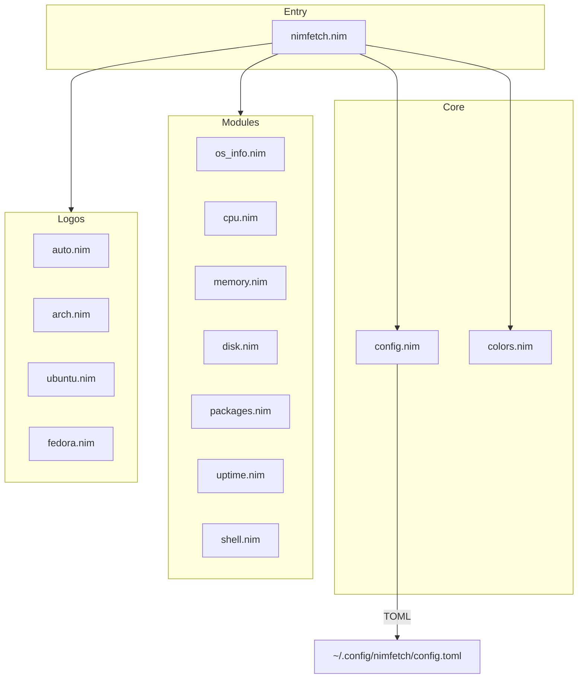
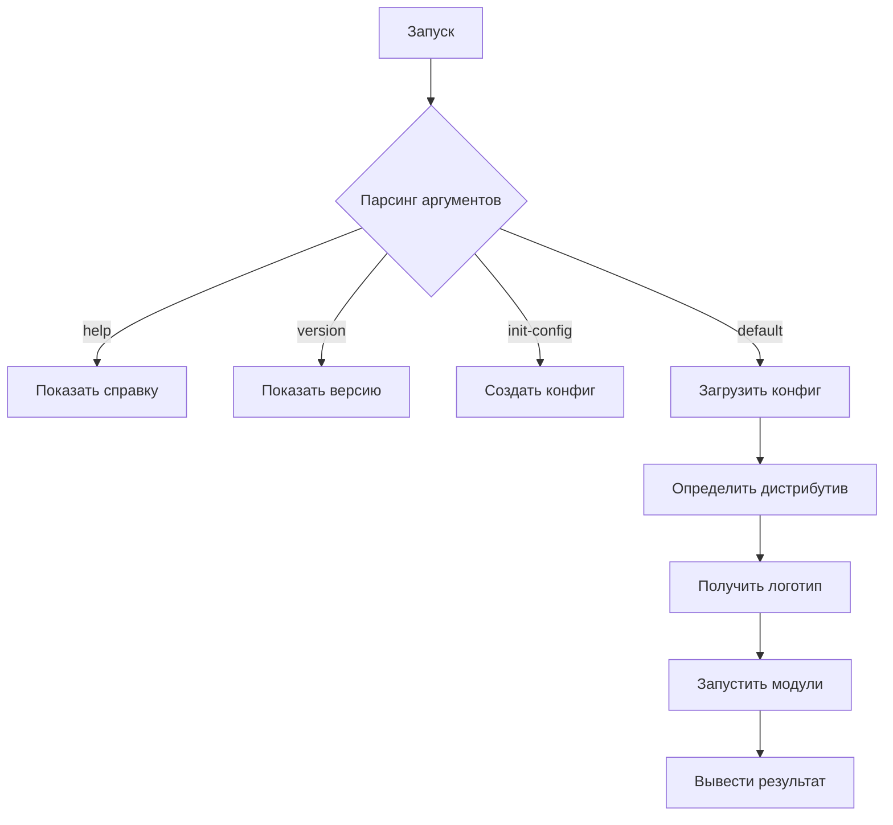

# План развития nimfetch

## Обзор проекта

**nimfetch** — быстрый инструмент вывода системной информации в терминале на языке Nim.

### Текущее состояние (v0.2.0)

| Компонент | Статус | Файл |
|-----------|--------|------|
| CLI аргументы | ✅ Готово | `src/nimfetch.nim` |
| Модуль цветов | ✅ Готово | `src/nimfetch/colors.nim` |
| Базовый вывод | ✅ Готово | `src/nimfetch.nim` |
| Конфигурация | ✅ Готово | `src/nimfetch/config.nim` |
| Модули системы | ✅ Готово | `src/nimfetch/modules/` |
| Логотипы | ✅ Готово | `src/nimfetch/logos/` |
| Battery модуль | ✅ Готово | `src/nimfetch/modules/battery.nim` |
| Media модуль | ✅ Готово | `src/nimfetch/modules/media.nim` |
| CPU Temp модуль | ✅ Готово | `src/nimfetch/modules/cpu_temp.nim` |

---

## Архитектура проекта



---

## Структура файлов

```
nimfetch/
├── nimfetch.nimble              # Конфигурация пакета
├── configs/
│   └── default.toml             # Пример конфигурации
├── src/
│   ├── nimfetch.nim             # Точка входа
│   └── nimfetch/
│       ├── colors.nim           # ✅ Модуль цветов
│       ├── config.nim           # Модуль конфигурации
│       ├── modules/
│       │   ├── os_info.nim      # ОС, ядро, дистрибутив
│       │   ├── cpu.nim          # Процессор
│       │   ├── memory.nim       # Оперативная память
│       │   ├── disk.nim         # Дисковое пространство
│       │   ├── packages.nim     # Количество пакетов
│       │   ├── uptime.nim       # Время работы
│       │   └── shell.nim        # Оболочка, DE/WM
│       └── logos/
│           ├── auto.nim         # Автоопределение логотипа
│           ├── arch.nim         # Arch Linux
│           ├── ubuntu.nim       # Ubuntu
│           └── fedora.nim       # Fedora
└── tests/
    └── test_config.nim          # Тесты конфигурации
```

---

## Этапы реализации

### Этап 1: Инфраструктура

#### 1.1 Обновление зависимостей

Добавить в `nimfetch.nimble`:
```nim
requires "toml >= 0.6.0"
```

#### 1.2 Создание структуры директорий

- `src/nimfetch/modules/`
- `src/nimfetch/logos/`
- `configs/`
- `tests/`

#### 1.3 Конфигурационный файл

Создать `configs/default.toml`:
```toml
[display]
enabled_modules = ["os", "kernel", "uptime", "packages", "cpu", "memory", "disk"]
separator = ": "
color_primary = "blue"
color_secondary = "white"

[logo]
type = "auto"
custom_path = ""
color = "blue"

[icons]
enabled = true
nerd_font = true
```

---

### Этап 2: Модуль конфигурации

#### 2.1 Структура Config

```nim
type
  DisplayConfig* = object
    enabledModules*: seq[string]
    separator*: string
    colorPrimary*: string
    colorSecondary*: string

  LogoConfig* = object
    logoType*: string
    customPath*: string
    color*: string

  IconsConfig* = object
    enabled*: bool
    nerdFont*: bool

  Config* = object
    display*: DisplayConfig
    logo*: LogoConfig
    icons*: IconsConfig
```

#### 2.2 Функции модуля

| Функция | Описание |
|---------|----------|
| `loadConfig(path: string): Config` | Загрузка конфига из файла |
| `saveDefaultConfig(path: string)` | Сохранение дефолтного конфига |
| `getDefaultConfigPath(): string` | Путь к конфигу пользователя |
| `validateConfig(cfg: Config): bool` | Валидация конфига |

---

### Этап 3: Модули системной информации

#### 3.1 Источники данных для Linux

| Данные | Источник | Альтернатива |
|--------|----------|--------------|
| Ядро | `/proc/sys/kernel/osrelease` | `uname -r` |
| Память | `/proc/meminfo` | — |
| Диск | `/proc/mounts` | `df -h /` |
| Uptime | `/proc/uptime` | — |
| DE/WM | `$XDG_CURRENT_DESKTOP` | `$DESKTOP_SESSION` |
| Пакеты | Зависит от дистрибутива | — |

#### 3.2 Определение пакетов по дистрибутиву

```mermaid
flowchart LR
    DIST[Определение дистрибутива] --> ARCH{Arch?}
    ARCH -->|Да| PACMAN[/var/lib/pacman/local/]
    ARCH -->|Нет| DEB{Debian/Ubuntu?}
    DEB -->|Да| DPKG[/var/lib/dpkg/status]
    DEB -->|Нет| RPM{Fedora/RHEL?}
    RPM -->|Да| RPMDB[/var/lib/rpm/Packages]
    RPM -->|Нет| OTHER[Прочие методы]
```

#### 3.3 Интерфейс модулей

Каждый модуль должен экспортировать:
```nim
proc getInfo*(): string      ## Получить информацию
proc isEnabled*(cfg: Config): bool  ## Проверить включенность
```

---

### Этап 4: Логотипы

#### 4.1 Автоопределение дистрибутива

Читать `/etc/os-release`:
```bash
ID=arch
ID_LIKE=arch
NAME=Arch Linux
```

#### 4.2 Структура логотипа

```nim
type
  Logo* = object
    lines*: seq[string]
    width*: int
    color*: Color
```

---

### Этап 5: Обновление точки входа

#### 5.1 Новые CLI опции

| Опция | Описание |
|-------|----------|
| `--init-config` | Создать дефолтный конфиг |
| `--no-config` | Игнорировать конфиг |

#### 5.2 Логика запуска



---

## Приоритеты реализации

| Приоритет | Задача | Сложность |
|-----------|--------|-----------|
| ⭐⭐⭐ | Конфигурация (TOML) | Средняя |
| ⭐⭐⭐ | Модуль памяти | Низкая |
| ⭐⭐⭐ | Модуль пакетов | Высокая |
| ⭐⭐⭐ | Логотипы | Средняя |
| ⭐⭐ | Модуль диска | Низкая |
| ⭐⭐ | Модуль uptime | Низкая |
| ⭐⭐ | Модуль DE/WM | Низкая |
| ⭐ | Тесты | Средняя |
| ⭐ | Документация | Низкая |

---

## Технические требования

### Кроссплатформенность

Использовать `when hostOS`:
```nim
when hostOS == "linux":
  # Linux-специфичный код
elif hostOS == "macosx":
  # macOS-специфичный код
elif hostOS == "windows":
  # Windows-специфичный код
```

### Производительность

- Минимум вызовов `execCmd`
- Предпочитать чтение из `/proc`
- Кэшировать результаты

### Обработка ошибок

```nim
try:
  let content = readFile("/proc/meminfo")
except IOError:
  return "N/A"
```

---

## Ожидаемый результат

После реализации пользователь сможет:

1. Запустить `nimfetch` и увидеть красивую системную информацию
2. Запустить `nimfetch --init-config` для создания конфига
3. Редактировать `~/.config/nimfetch/config.toml` для кастомизации
4. Видеть логотип своего дистрибутива

### Пример вывода

```
                   -`                 gin@archlinux
                  .o+`                --------------
                 `ooo/                OS: Arch Linux x86_64
                `+oooo:               Kernel: 6.18.1-arch
               `+oooooo:              Uptime: 3 hours, 42 mins
               -+oooooo+:             Packages: 1842 (pacman)
             `/:-:++oooo+:            Shell: zsh 5.9
            `/++++/+++++++:           DE: Hyprland
           `/++++++++++++++:          Memory: 8.2G / 32G
          `/+++ooooooooooooo/`        Disk: 234G / 500G
         ./ooosssso++osssssso+`       
        .oossssso-````/ossssss+`      
       -osssssso.      :ssssssso.     
      :osssssss/        osssso+++.    
     /ossssssss/        +ssssooo/-    
   `/ossssso+/:-        -:/+osssso+-  
  `+sso+:-`                 `.-/+oso:
 `++:.                           `-/+/
 .`                                 `/
```

---

## Следующие шаги

1. Переключиться в **Code** режим
2. Начать с добавления зависимости `toml` в `nimfetch.nimble`
3. Создать структуру директорий
4. Реализовать модуль конфигурации
